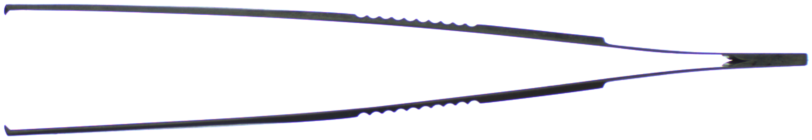
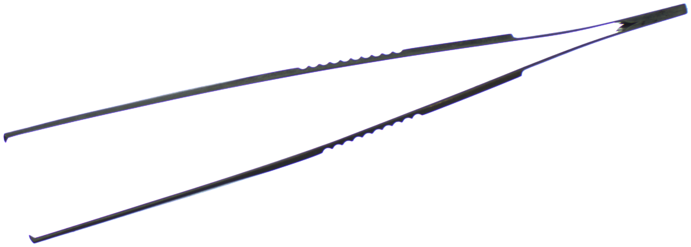
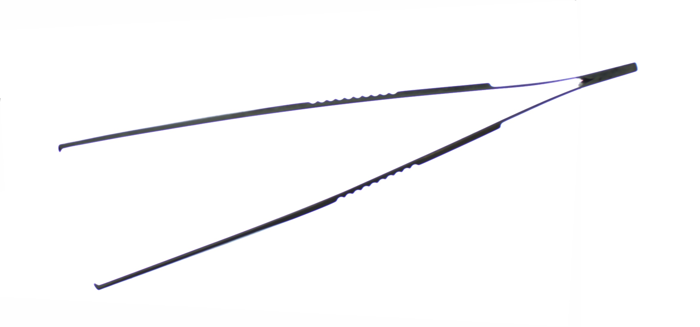
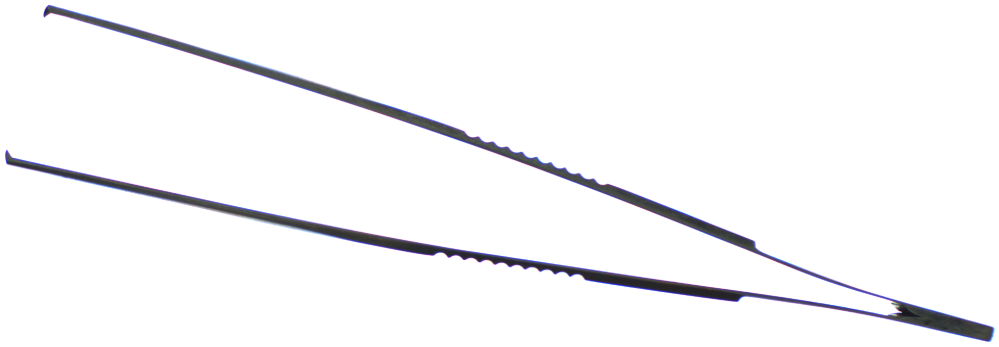
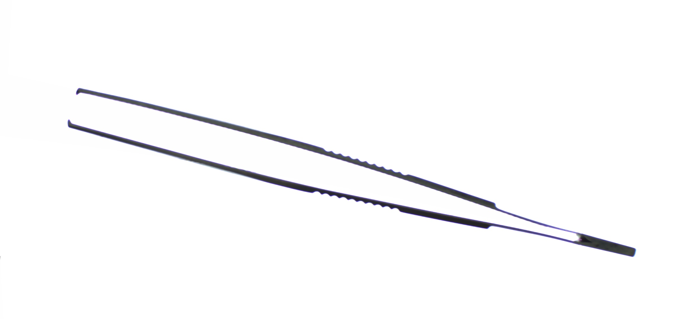

# Generation of Artificial Images

This project aims to generate artificial images of pincer tools with varying degrees of opening from real RGB images. The program automatically generates these images based on an input angle that defines the difference in the opening angle between the source image and the desired image.

## Features

- Automatically generate artificial images of pincers with varying degrees of opening.
- Processes images in a specified folder and saves the output images with the applied transformations.


### Requirements

- **Python:** The script has been developed and tested with Python 3.8.2.
- **Libraries:** The following libraries are required:
  - numpy 1.24.4
  - opencv 4.9.0
  - SciPy
  - os 
  - argparse


## Installation

1. Clone the repository:

   ```sh
   git clone https://github.com/yourusername/Generation-of-Artificial-Images.git
   cd Generation-of-Artificial-Images


   


 - <command>: Command" refers to the difference in the angle value (expressed in degrees) between the two branches between the source image and the desired image.
The angle should be between -10 and 20 degrees.
 - <image_folder>: The path to the folder containing the images to be processed.


  


## Program Results Exemple

In this section, you can view the program results. The original image is displayed on the left, while the program's result is displayed on the right.


<table><tr>
<td> 
  <h3 align="center">Original Image</h3>
  <p align="center" style="padding: 10px">
    
  </p> 
</td>
<td> 
  <h3 align="center">Generated image with command = 0</h3>
  <p align="center">
    
  </p> 
</td>
</tr></table>


<table><tr>
<td> 
  <h3 align="center">Original Image</h3>
  <p align="center" style="padding: 10px">
    
  </p> 
</td>
<td> 
  <h3 align="center">Generated image with command = 6</h3>
  <p align="center">
    
  </p> 
</td>
</tr></table>


<table><tr>
<td> 
  <h3 align="center">Original Image</h3>
  <p align="center" style="padding: 10px">
    
  </p> 
</td>
<td> 
  <h3 align="center">Generated image with command = -6 </h3>
  <p align="center">
    
  </p> 
</td>
</tr></table>


## Contributing

Feel free to fork this project, submit issues and pull requests. Contributions are welcome!
